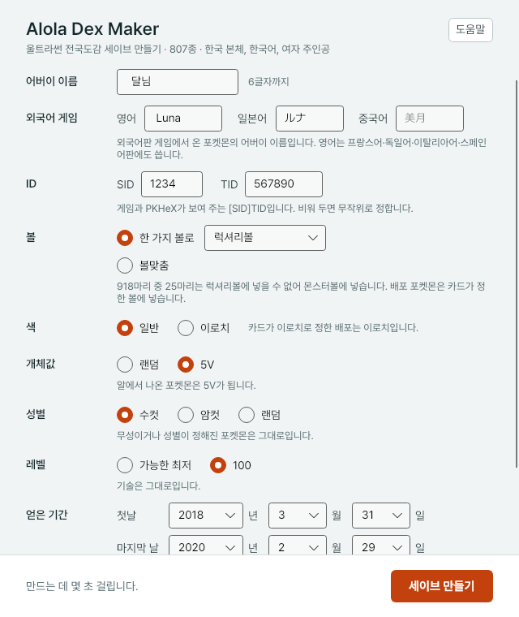

# Dexforge

Dexforge makes a Pokémon Ultra Sun living-dex save (807 species, 952 Pokémon) in the name and ID of whoever will use it.
The program carries a template save inside it and, every time it runs, draws every Pokémon in that save afresh.
Each Pokémon's values are drawn in the order the game actually draws them, from a state the game's RNG could really be in.

It makes saves for a Korean console only: Ultra Sun, Korean language, the female protagonist.

It also makes an **event box**: every distribution card of generations III to VII, with the per-country copies of one event counted once (Korea > Japan > US > Europe), 751 distributions; eggs are hatched, and unevolved gifts get their final evolutions added, for 928 Pokémon in one Ultra Sun save. Each one's received date is a day inside the distribution window, which was matched against five sources. The 32 free slots are filled with things you pick yourself from what the rules left out. See the "배포 박스" (event box) section of the in-app help.

And a **Sword** living dex: every species and form of the three Galar dexes (Galar, Isle of Armor, Crown Tundra), 663 species and 760 Pokémon, plus every distribution Sword itself received (81, each on a day of its own window — what one code hands over together on one day — with their final evolutions by the event box's rules: 159 more), as a backup folder that JKSV restores. What can hatch is hatched (following the Sword/Shield egg RNG order as written down by Admiral Fish); fossils are fossils, legendaries come from their static encounters and Dynamax Adventures (Zamazenta and the Shield-only ones caught in the trainer's own Shield and traded over), mythicals from event cards. A species that is shiny only by a card is kept as its plain catch; the card sits among the distributions. See the "소드" (Sword) section of the in-app help.

And a **Legends: Arceus** living dex: every species and form of the Hisui dex, 242 species and 313 Pokémon, as a JKSV backup folder, with every species' research at level 10. Wild catches are drawn from spawner seeds the way the game draws them — a generator seed whose slot draw lands on the species (alpha or not), the fixed seed it gives, and the level — so the PLA bot's own seed check holds as well as PKHeX's. Evolutions are caught as their nearest earlier stage and evolved, legendaries and starters are their static encounters, form changes are made from the form caught. A size option asks for the smallest (height and weight 0, found by solving the RNG's linear equations rather than searching), alphas wherever the game has one, or whatever the game draws. See the "LEGENDS 아르세우스" section of the in-app help.

And a **Scarlet** living dex: every species and form of the Paldea, Kitakami and Blueberry dexes, 695 species and 836 Pokémon, plus every distribution Scarlet itself received (82 cards, each on a day of its own window — what one code hands over together on one day, and the window checked against PKHeX's own — with their final evolutions by the event box's rules: 100 in all; the three cards only Violet receives come from the trainer's own Violet), as a JKSV backup folder with the Pokédex complete. Whatever is wild is caught wild, as a shiny hunter catches it in a mass outbreak: the values come from a 64-bit seed the way the game draws them (PKHeX's own gen 9 generation, eight shiny rolls, the Tera type the species' own from the same seed), evolutions are caught as their nearest earlier stage and evolved, fixed symbols are what the game fixes (plain, shiny-locked), the starters hatch, and a raid or an in-game trade stands in only where nothing else gives the species. What only Violet has is caught in the trainer's own Violet and traded over. A size option asks for the smallest (scale 0, with the Mini Mark) or the largest (scale 255, the Jumbo Mark), found by solving the RNG's equations. See the "스칼렛" section of the in-app help.

The program speaks Korean: the window, the help, the messages and the option words. The command line also accepts the English words listed below for most options.



## The window

Double-click `Dexforge.exe` and the window opens. Choose the options with the boxes and buttons and press **세이브 만들기** (make the save).
It is a single file; there is nothing to install.

- Pressing the button without touching anything uses the defaults in the table below.
- The result is written into the chosen **저장할 곳** (output folder) as `Dexforge-<name>-<TID>`. At first that is the folder the program is in.
- If a save cannot be made, the reason is shown. If the program crashes, it leaves `Dexforge-오류.txt` next to itself.
- **도움말** (help), top right, is the manual for the person receiving the save. The text is `src/Dexforge.Gui/Assets/help.md`;
  it uses only headings (`#`, `##`, `###`), lists (`-`) and bold (`**`). Rebuild after editing it.

The seed (`--seed`) and template refresh (`--refresh`) are command-line only.

## The command line

Run `Dexforge.Cli` with no arguments and it asks for the Ultra Sun options one by one; leave an answer blank to take the value in brackets. Sword and the event box are made with arguments only.

```
Dexforge.Cli --name 미월 --sid 1234 --tid 567890 --ball 럭셔리볼 --color shiny --ivs 5V --sex random --level lowest --from 2018-01-01 --to 2018-12-31
```

For Sword put `--game sword` first. The options that apply are `--name --sid --tid --ball --color --year --seed --out`.

```
Dexforge.Cli --game sword --name 우리 --ball 볼맞춤 --color shiny --year 2021
```

For Scarlet put `--game scarlet` first; the options are the same as Legends: Arceus's but the ball is any of the 25 (or `볼맞춤` for the ones picked) and `--size` takes `smallest` or `largest`; the period defaults to 2024.

For Legends: Arceus put `--game arceus` first. The options are `--name --sid --tid --ball --color --size --sex --level --from --to --seed --out`; the ball is one of the Hisuian balls, and the period defaults to the release year 2022.

```
Dexforge.Cli --game arceus --name 미월 --ball 페더볼 --size alpha --color shiny
```

For the event box put `--game eventbox` first. The options are `--name --sid --tid --seed --out --first-days --pick --pick-file`; `--list-picks` prints everything that can go into the free slots, with its key.

```
Dexforge.Cli --game eventbox --name 미월 --first-days 7 --pick D:2522,E:1215:26-0
```

| Option | Values | Default |
|---|---|---|
| `--game` | `ultrasun` (울트라썬) / `sword` (소드) / `eventbox` (배포박스) / `arceus` (아르세우스) | `ultrasun` |
| `--size` | (Legends: Arceus, Scarlet) `smallest` (최소), `alpha` (우두머리, Arceus), `largest` (최대, Scarlet), `random` (랜덤) | `random` |
| `--year` | (Sword) the year the Pokémon were obtained, 2019–2099 | 2021 |
| `--first-days` | (event box) received dates fall within the first n days of each distribution window; 0 means the whole window | 0 |
| `--pick`, `--pick-file` | (event box) keys of what to put in the free slots, comma-separated / a file with one key per line | none |
| `--name` | the original trainer's name, up to 6 characters | 미월 |
| `--english` `--japanese` `--chinese` | the trainer's name in foreign-language games, up to 7 / 5 / 6 characters | Selene, ミヅキ, 美月 |
| `--sid` `--tid` | SID, four digits (0000–4294); TID, six digits (the ID the game shows). PKHeX's [SID]TID | random |
| `--ball` | a ball name in Korean, or `볼맞춤` (a ball chosen per Pokémon) | 몬스터볼 (Poké Ball) |
| `--color` | `normal` (일반), `shiny` (이로치) | `shiny` |
| `--ivs` | `random` (랜덤), `5V` | `random` |
| `--sex` | `male` (수컷), `female` (암컷), `random` (랜덤) | `random` |
| `--level` | `lowest` (최저), `100` | `lowest` |
| `--from` `--to` | first and last day of the period the Pokémon were obtained in | 2018-01-01 – 2018-12-31 |
| `--ribbons` | (Ultra Sun, Sword) ribbons to put on every Pokémon that can take them, by Korean name, comma-separated (`--list-ribbons` prints the game's list with their titles) | none |
| `--seed` | the seed of the draw | random |
| `--out` | the folder to write into | `Dexforge-<name>-<TID>` |

- **Ball**: naming a ball puts everything in that ball; a Pokémon that cannot be in it goes in a Poké Ball. `볼맞춤` uses the ball chosen for each Pokémon.
  Event Pokémon are always in the ball their card says. A Pokémon barred from the ball only because of its hidden ability gets a normal ability instead.
- **Colour**: shiny-locked Pokémon are always normal, and events whose card says shiny are always shiny.
- **IVs**: `5V` gives five 31s to the Pokémon that came from eggs only. Events and generation III–IV origins keep whatever that game gave, either way.
  6V is left out: for the three caught in the wild (Ditto, Dewpider, Araquanid) a 6V RNG position is one in a billion, so they would all have to be found in advance.
  `IvChoice.Six` remains in the generator (6V only where eggs and guaranteed 31s allow). SOS battles do not make 6V easy: a chain fills only up to four 31s.
- **Sex**: applies only to boxed Pokémon whose sex can change. Genderless Pokémon, single-sex species, what a card or encounter fixed, and species boxed in both sexes for their different looks stay as they are.
  Random follows the species' gender ratio, by the RNG. The rules are in `Options/Sexes.cs`.
- **Level**: `100` sets every boxed Pokémon to level 100. Moves are unchanged.
- The three **party** Pokémon follow only the ball, not the other options. The party cannot go to Pokémon Bank, so it is of no use.
- **Ribbons**: each chosen ribbon goes on every Pokémon PKHeX still accepts with it; Pokémon from cards keep only what their card gave. Only ribbons a player can earn are offered (no event-only ribbons); 16 of them are earned in games a seventh-generation Pokémon cannot visit and go only on what came up from the fourth generation. Sword offers the five earned in Sword itself (Galar Champion, Tower Master, Master Rank, Effort, Best Friends); the Master Rank Ribbon skips the mythicals Ranked Battles bar, and marks are not offered because nothing in that dex was caught in the wild. The Effort Ribbon fills 510 effort points the way the species is trained — a tank (HP, Defense), a slow attacker (Attack or Sp. Attack, HP) or a fast one (Attack or Sp. Attack, Speed), by the majority of Smogon's gen 7 singles sets, with pre-evolutions following their final form (`Data/template/effort.tsv`) — the Best Friends Ribbon maxes affection, the Footprint Ribbon needs 30 levels over the met level. The titles shown are the ones the eighth generation attaches, as players have transcribed them.
- **Period**: giving the same first and last day puts everything on that one day. A 3DS clock can be set freely, so any period within 2000-01-02 – 2099-12-31 works.
  Events are dated within their distribution window. The adventure start is set at least three weeks before the first day.

It takes a few seconds.

## What comes out

- `main` — the save file
- `만든기록.txt` — the trainer, the options, and for every Pokémon the RNG position its values came from

A made save checks itself before it is written (`Making/Check.cs`); if anything is off, nothing is written.
It checks that everything passes PKHeX's legality analysis, that the template's name and ID are gone, that the chosen options were applied, the order of dates, the game records, and the blocks that must not change.

## How values are drawn

| Pokémon | RNG | Reference | Code |
|---|---|---|---|
| Eggs | TinyMT | 3DSRNGTool | `Rng/Egg.cs` |
| Caught or received in generation VII | SFMT | 3DSRNGTool | `Rng/Seven.cs`, `Making/Caught7.cs` |
| Generation III–IV origins | LCRNG, MT19937 | PokeFinder | `Rng/Old.cs`, `Making/Older.cs` |
| Events | as the card says | PKHeX | `Data/Events.cs`, `Making/Generator.cs` |

Put the seed and frame written in `만든기록.txt` into 3DSRNGTool (PokeFinder for generations III–IV) and the same Pokémon comes out.

Assumptions:

- The trainer has the Shiny Charm. Only the three party Pokémon, from the first days of the adventure, predate it.
- No Synchronize lead.
- Wild encounters are honey encounters.
- Egg parents are one of the species and a foreign Ditto (Masuda method).
- The button was pressed within about 30 minutes of loading the save.

Not verified:

- Pikipek at level 4 on Route 1. 3DSRNGTool's table has only level 2–3 grass; PKHeX's table has a separate level 2–4 patch with the same species. The level range from PKHeX was used with 3DSRNGTool's slot layout.
- Whether both Pokémon Bank and Pokémon HOME accept everything.
- Running on Windows was confirmed by the owner on real hardware; development and tests run on Linux (the window is tested headless and on a virtual display).

## Layout

```
src/
  Dexforge.Core/    the generator library
    Options/             what can be chosen and its rules (Options, Trainer, Ids7, ForeignNames, Sexes)
    Rng/                 the games' RNGs and one encounter drawn from them (Seven, Egg, Old)
    Data/                3DSRNGTool's tables, event cards, per-ball tables, the template save (template/dex)
    Making/              making and checking the save (Generator, Caught7, Older, Check, Making)
    Sword/               Sword: egg RNG (Xoroshiro8, Egg8), species, forms and origins (Plan8), balls (Balls8), making (Maker8, Evolve8), writing the save (Making8)
    Data/sword/          the Sword template (the three files main and JKSV share), the ball table (balls.tsv), HOME trackers (trackers.tsv), the distributions and their windows (events.tsv)
    EventBox/            the event box: listing cards (Cards), receiving trainers (Receivers), card to Pokémon (EventMaker), evolution (Evolve7), picking (Custom), writing the save (EventBoxMaking)
    Data/events/         the distribution list (distributions.tsv): 2,630 cards merged into 855 distributions, dated
    Arceus/              Legends: Arceus: the RNG and the spawn as the game draws it (Xoroshiro8a, Spawn8a), generator seeds from fixed seeds (Generator8a),
                         the smallest sizes by linear algebra (SizeSeeds8a), the spawner table (Spawners8a), the plan (Plan8a), making (Maker8a, Evolve8a), writing the save (Making8a)
    Data/arceus/         the Legends: Arceus template (main, backup, main2, the JKSV meta file) and the spawner table (spawners.tsv)
    Scarlet/             Scarlet: the seeded spawn (Spawn9), the plan (Plan9), balls (Balls9), the distributions (Events9), the evolver (Evolve9), the maker (Maker9) and the save (Making9)
    Data/scarlet/        the Scarlet template (main, backup, poke_trade, the JKSV meta file), the plan (plan.tsv), the ball table (balls.tsv) and the distributions with their windows (events.tsv)
    Wording/             understanding and speaking the options in Korean
  Dexforge.Cli/     the command line
  Dexforge.Gui/     the window (Avalonia)
tests/
  Dexforge.Core.Tests/   generator tests and reference vectors
  Dexforge.Cli.Tests/    command-line tests (arguments, the question-by-question mode, refusals, template refresh)
  Dexforge.Gui.Tests/    window tests (the window is opened headless, filled in and its button pressed)
tools/
  Reference/    a test bench compiled from 3DSRNGTool's original source, and the script that makes the reference vectors
  BallTable/    makes the per-ball "cannot be in this ball" table (Data/BallFits.cs)
  pla-spawners/ makes the Legends: Arceus spawner table from the game's spawner data (through the PLA bot's seed tools)
docs/screenshots/   pictures of the window (taken by the tests with DEXGEN_GUI_SHOTS)
```

## Building and testing

The .NET 10 SDK is required.

```
dotnet build -c Release
dotnet test -c Release                                    # about a minute
DEXGEN_SLOW=1 dotnet test -c Release                      # includes the shiny 6V test, about 3 minutes
DEXGEN_GUI_SHOTS=<folder> dotnet test -c Release          # also leaves pictures of the window in that folder
dotnet test -c Release --collect:"XPlat Code Coverage"    # line coverage (TestResults/…/coverage.cobertura.xml)
```

A single-file build for distribution:

```
dotnet publish src/Dexforge.Gui -c Release -r win-x64 --self-contained true -p:PublishSingleFile=true \
  -p:IncludeNativeLibrariesForSelfExtract=true -p:EnableCompressionInSingleFile=true -p:DebugType=none -o publish/win-x64
```

The command-line build uses the same command with `src/Dexforge.Cli`. One exe is all that needs to be handed over.

What the tests check:

- that the values we draw match 3DSRNGTool's and PokeFinder's (`tests/Dexforge.Core.Tests/vectors`)
- that option words are understood and bad values refused (both as arguments and in the question-by-question mode)
- that a made save is intact and follows the chosen options
- that drawing a made save's Pokémon again from its recorded RNG position gives the same values
- that the template is intact
- that the window opens with the intended defaults, reads what was filled in, writes an intact save when the button is pressed, and refuses bad values with a reason

## When the template changes

The template is `src/Dexforge.Core/Data/template/dex` and is embedded at build time. Change it and rebuild.

If a Pokémon was newly added to the template, draw its values by the game's RNG as well. Dates, balls and trainers stay; only the values of eggs and caught Pokémon are drawn again.

```
Dexforge.Cli --refresh <save> <output folder> [--only 590,591]
```

If the template's Pokémon or the ball rules change, remake the "cannot be in this ball" counts the window shows. It makes a save per ball to count them, about 3 minutes.

```
dotnet run -c Release --project tools/BallTable > src/Dexforge.Core/Data/BallFits.cs
```

A new kind of Pokémon in the template (a new event, a new old-generation capture) needs its rule in `Data/Events.cs` or `Making/Older.cs` first.

## Remaking the reference vectors

The generation VII files in `tests/Dexforge.Core.Tests/vectors` were produced by compiling 3DSRNGTool's original source, unmodified.

```
cd tools/Reference
git clone https://github.com/wwwwwwzx/3DSRNGTool
dotnet build -c Release
python3 make-vectors.py ../../tests/Dexforge.Core.Tests/vectors
```

`Data/SevenTable.cs` and `Data/SevenAreas.cs` are that tool's tables as printed by this bench's `list` and `areas` modes.

## Sources and licence

This program is GPLv3 (`LICENSE`). PKHeX.Core is GPLv3, so whoever is given the program must be able to get its source on the same terms.

- [PKHeX.Core](https://github.com/kwsch/PKHeX) — GPLv3. Reading and writing saves, legality analysis.
- [3DSRNGTool](https://github.com/wwwwwwzx/3DSRNGTool) — MIT. Generation VII generation order and area tables. Not in this repository; fetched only to make the reference vectors.
- [PokeFinder](https://github.com/Admiral-Fish/PokeFinder) — GPLv3. Generation III–IV reference values.
- [PKHeX](https://github.com/kwsch/PKHeX) — GPLv3. The ribbon pictures in `src/Dexforge.Gui/Assets/ribbons/` are PKHeX's.
- [pla-reverse](https://github.com/Lincoln-LM/pla-reverse) — GPLv3. The order a Legends: Arceus spawn is drawn in and the byte-sliced recovery of a generator seed from a fixed seed, ported to the CPU.
- [numba-pokemon-prngs](https://github.com/Lincoln-LM/numba-pokemon-prngs) — the game's spawner tables, read when building the spawner table (not at run time).
- [Avalonia](https://github.com/AvaloniaUI/Avalonia) 11.3 — MIT. The window.
- [Pretendard JP](https://github.com/orioncactus/pretendard) 1.3.9 — SIL OFL 1.1. The window's font (the edition with Hangul, kana and kanji).
  Full licence text in `src/Dexforge.Gui/Assets/Pretendard-LICENSE.txt`.
